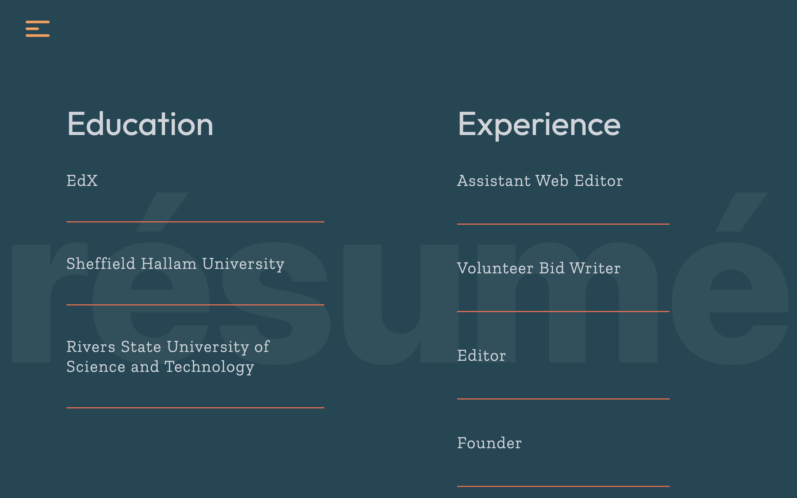

# Portfolio

It's my web developer portfolio created in React. 

## Table of contents

- [Overview](#overview)
  - [Screenshot](#screenshot)
  - [Links](#links)
- [My process](#my-process)
  - [Built with](#built-with)
- [Future development](#future-developments)

## Overview

The goal was to create an interactive website that was minimal and clean, and effective and fully responsive regardless of device. I have (mostly) succeeded in accomplishing that here.

### Screenshot

### Links

- Live site URL: [Portfolio](https://chukwudibarrah.netlify.app/)

## My process

### Built with

Some of the tech that went into building the website include the following (not exhaustive) list:

- Semantic HTML5 markup
- [Vite](https://vitejs.dev/)
- [Tailwindcss](https://tailwindcss.com/)
- [Framer Motion](https://www.framer.com/motion/)
- [Lottie Files](https://lottiefiles.com/)
- [FaunaDB](https://fauna.com/) - serverless database
- [Vercel](https://vercel.com/) - hosting
- [Contentful](https://www.contentful.com/) - Content CMS
- [TypewriterJS v2](https://github.com/tameemsafi/typewriterjs)

## Future developments

- Add a filter to the projects page to allow easy filtering/visualisation of the different projects by web development or editorial characteristics/tags.